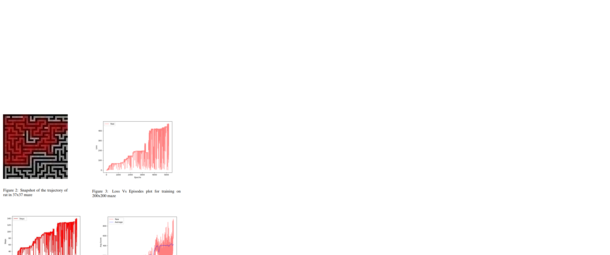

# Dynamic_Maze_Solving
COMP6247 (Reinforcement Learning) Coursework 

### Problem:
We are given a 199 x 199 maze environment surrounded by walls. The agent’s goal is to compute the optimal path from the top left corner (1,1) to the bottom right corner (199,199). Each location has a binary value associated with it, which could be a wall or an empty spot. This problem is made further challenging by adding dynamic firing at random locations. However, I have only considered a static maze and left the handling of active firing for future improvements of this project.

### Solution:
I proposes an epsilon-greedy Dueling Deep Q-Network Based on Prioritised Experience Replay to compute the minimal time path for traversing a maze. The deep Q-Network selects and calculates the target Q value. The duelling network optimises the algorithm’s stability by separating the state value and the state action. Prioritised experience replay is used to extract experience samples, increase the utilisation rate of important samples and accelerate the training speed of the neural network. Finally, the e-greedy descent method is used to find the optimal strategy and prevent the agent from getting stuck in locations, prompting it to explore. The experiments are first conducted
on (5x5), (7x7), (37x 37) and (199x199) mazes to analyse the impact of algorithm hyperparameters on the model and set their values. Results demonstrate the effectiveness of the proposed algorithm.
  
The loss and score were observed to saturate once the epsilon value reached a constant minimum. To improve the speed of traversal, learning has to run for longer epochs for the 200x200 maze.

### Results:
 

The algorithm was evaluated for (5x5), (7x7), (37x37) and (200x200) mazes. The results are shown in table 2. It was observed that in smaller mazes, the agent took the optimal path and reached the goal state in less than a minute. As the size of the maze increased, due to the hard bound on the number of episodes during training, learning did not converge. This was observed in the cases of 200x200 maze. The logs of the training and the associated models are made available in the code repository. The output file submitted corresponds to the 37x37 maze. The results demonstrate the effectiveness of the proposed solution in finding the optimal path in minimum time.
  
It can be seen that the loss during the first 3000 episodes is fairly low. This can be attributed to setting the value high at 0.8. As the value hits the minimum
of 0.003, the learning slows and the agent was seen to have a higher tendency of remaining in a location. However, the epsilon-greedy decent method prevented the agent from being stuck in one place for too long in the early stages of training. Decreasing the epsilon value was observed to reduce the agents reliance on the ε-greedy algorithm and choose optimal paths without getting stuck during evaluation.
  
It was observed that terminating the episode when the agent crossed the threshold of max visits to a location or wall during training, reduced the overall wall and visit counts during evaluation.
  
More details about the implementation can be found in the <a href="RL_implementation.pdf">Report</a>.
